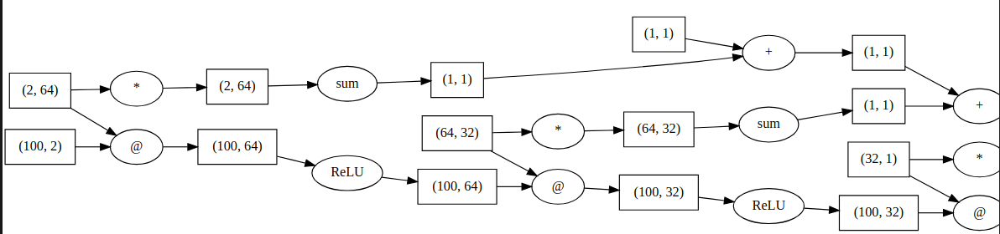

# Welcome to MatrixGrad !

This is an extension to the MicroGrad library that is mad by **karpathy**. For more details check the [official repo](https://github.com/karpathy/micrograd).
The goal was to implement a more generalized autograd that works with vectors and matrices.

All the features of micro-grad are supported like tracing and visualization of the compuation graph.

## Unit tests :

Both the forward and backward functions are tested.

## Key changes :

- Adapting the elemetary functions to work with matrices and vectors.
- adding new functions for vectors like sum, and matmul,sigmoid ...
- Removing the Neuron class to work with a vectorized Layer implementation.

## A computation graph example:

This is a a subgraph from the full graph computed in the demo .



For more details check the associated notebook

## How to use ? :

```python

class MLP(Module):

    def __init__(self, layer_shapes: list[int], nouts):
        """
        layer_shapes: list of integers, the number of nodes in each layer(including input layer)\n

        nouts: the number of output nodes
        """
        self.layers = [
            Layer(nin, nout, nonlin=True)
            for nin, nout in zip(layer_shapes, layer_shapes[1:])
        ]
        self.layers.append(Layer(layer_shapes[-1], nouts, nonlin=False))

```

an MLP instance takes a list of intergers that represents the number of inputs for each layer, and an integer to represent the output size for the output layer.

When calling, MLP supports either a Tensor object, a numpy array , or a raw list or number

## example

```python

x=[1,1]
model = MLP( [2,64,32],1)  # 2-layer neural network
model(x)
```

It gives something like this


## the do the optimazation of the model weights:

#### 1. Define a loss function with this paradim

```python
def loss():
    predictions=model(x)

    L=F(predictions,y)# F is any function  you see fit for a loss

    ....
    return L
```

Make sure to visualize the Loss graph to make sure that your loss calculation did not prune the previous children as this may happen if not using the tensor objects correctly.

#### 2. Training loop:

It should be of this template:

```python
t = 10000  # Total training steps

learning_rate=1 #just a sample example value
for k in range(t):
    error=loss()
    #model.zero_grad() Zero out gradients before backward pass
    error.backward()

    for  p in model.parameters():

            p.data -= (learning_rate * p.grad)

```
